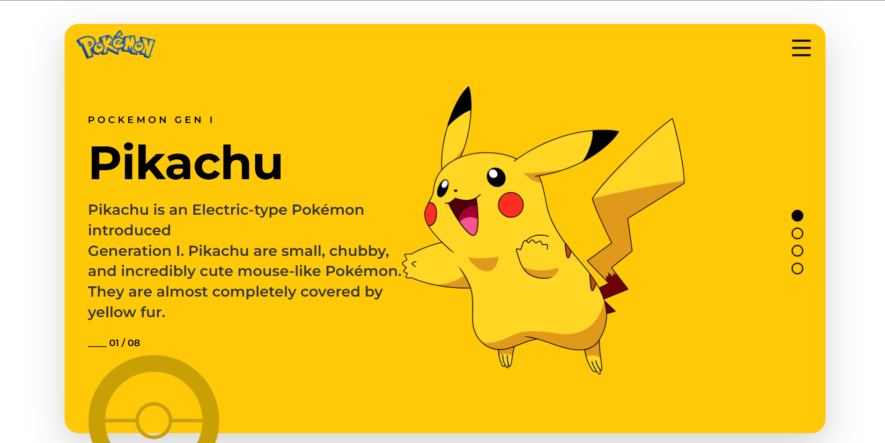

A responsive Pokémon-themed landing page built using **HTML5** and **CSS3** as part of **Assignment #1 of Cohort 2.0**.

## 🚀 Live Demo

🔗 https://bhaveshbhoi256.github.io/Pok-dex-gen1-showcase/

## 📸 Preview



## 🛠️ Tech Stack

- HTML5
- CSS3

## ✨ Features

- Pokémon Gen 1 inspired design
- Responsive layout
- Pure HTML & CSS implementation
- Clean and modern UI
- Custom styling and positioning

## 📂 Project Structure

```text
Pok-dex-gen1-showcase/
├── index.html
├── style.css
├── pokemon.png
├── pikachu.png
├── pokeball.png
├── menu-line.png
├── circle-fill.png
├── circle-line.png
└── README.md
```

## 📚 Assignment Details

This project was built as **Assignment #1 of Cohort 2.0**, focused on practicing core frontend development concepts using HTML and CSS by recreating a visually appealing landing page.

## 🎯 Learning Outcomes

- HTML page structure
- CSS styling
- Flexbox layouts
- Positioning elements
- Responsive design fundamentals

## 👨‍💻 Author

**Bhavesh Bhoi**

GitHub: https://github.com/bhaveshbhoi256

---

⭐ Feel free to explore the project and share your feedback.
